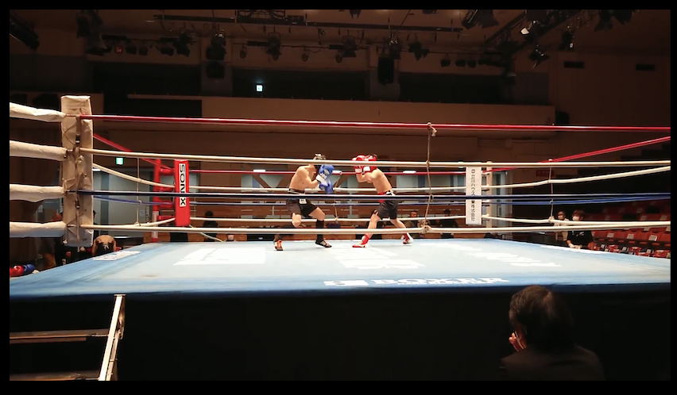

  

  

  

  
PROFILE
--------------------------------------------------------------------

nodachan

web engineer

movie creator

Professional Boxer (former)

Main
---------------------------------------------------------------------
・JavaScript

・TypeScript
  
・Python

FW
---------------------------------------------------------------------
・React

・Django(backend)

URL
------------------------------------------------------------------------
  
  ・Portforio
  
  https://nodachan.herokuapp.com/
  
  
・Qiita account
  
https://qiita.com/ytnd0928

・movies
  
https://yetianxiongfei.wixsite.com/my-site

・Twitter account
  
https://twitter.com/nodachan9
  
  

<!--
**ytnd0928/ytnd0928** is a ✨ _special_ ✨ repository because its `README.md` (this file) appears on your GitHub profile.

Here are some ideas to get you started:

 I’m a college student

-->
